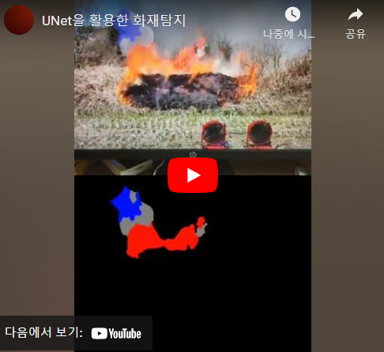
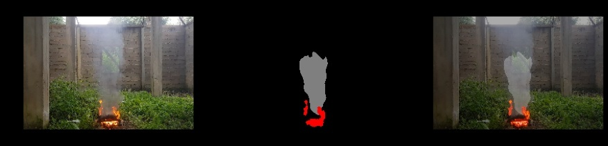
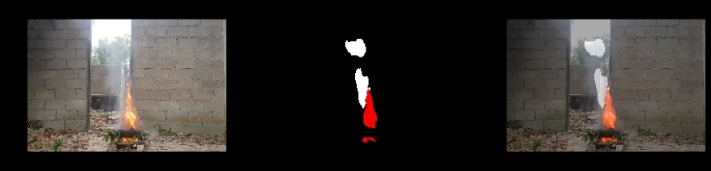
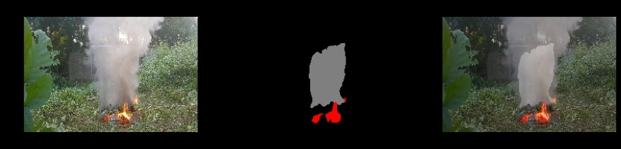
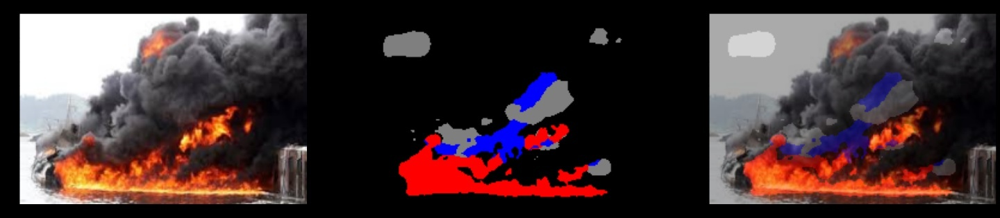
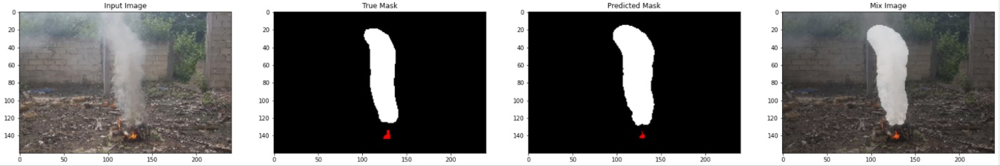

# 화재 탐지 Segmentation

Depth : 5, Initial Feature : 32 에서의 실험 영상

|Depth|Initial Feature|mIoU|FPS|
|------|---|---|---|
|5|32|64.2%|7.63|
|4|32|62.1%|8.23|
|5|16|63.3%|9.12|
|4|16|60.1%|10.09|
|4|8|57.4%|12.32|
|3|16|53.9%|13.78|

## 결과

검은색 빨간색 파란색 회색 흰색 은 각각
배경,불,검은 연기,회색 연기,흰색 연기를 의미합니다.

### Test
좌:Input 중:Mask 우:Mix(Input+Mask)

### Train

